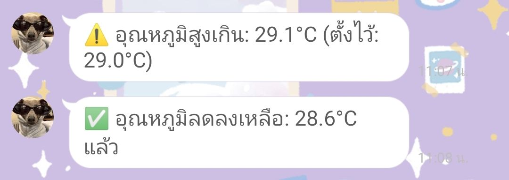

# 🐣 ระบบสมาร์ทฟักไข่ ESP32

ระบบควบคุมการฟักไข่อัตโนมัติ โดยใช้ ESP32 ตรวจวัดอุณหภูมิ  
ควบคุมแสงสว่าง (LED) และพัดลม พร้อมแสดงผลผ่านหน้าจอ Nextion  
แจ้งเตือนผ่าน LINE Notify หากอุณหภูมิสูงกว่าที่กำหนด

---

## 🔧 คุณสมบัติหลัก

- วัดอุณหภูมิแบบเรียลไทม์ ด้วย DS18B20
- แสดงผลบนหน้าจอ Nextion (ค่าปัจจุบัน, สถานะ, แถบสถานะ)
- ควบคุมแสงสว่างอัตโนมัติและแบบแมนนวล (ผ่าน MQTT/Node-RED)
- เปิดพัดลมเมื่ออุณหภูมิสูงกว่าค่าที่กำหนด
- ปรับเปลี่ยนค่าเป้าหมายจาก Node-RED (ComboBox หรือ Slider)
- แจ้งเตือนผ่าน LINE Notify เมื่ออุณหภูมิสูงเกินหรือลดลง

---

## 🖥️ หน้าจอและ UI

### 📊 Node-RED Dashboard

แสดงค่าพารามิเตอร์ต่างๆ และควบคุมได้จากระยะไกล  

---

### 📺 หน้าจอ Nextion

แสดงค่าอุณหภูมิ, สถานะไฟ LED, พัดลม และแจ้งเตือน  

---

### 📲 แจ้งเตือน LINE Notify

ส่งข้อความอัตโนมัติเมื่ออุณหภูมิสูงเกินค่าที่กำหนด หรือกลับสู่ปกติ  

---

## 🧰 อุปกรณ์ที่ใช้

- ESP32 DevKit V1
- เซ็นเซอร์อุณหภูมิ DS18B20
- หน้าจอ Nextion
- พัดลม DC
- หลอดไฟ LED (ควบคุมแสง)
- บัซเซอร์หรือ Alarm
- ระบบ Node-RED บน PC หรือ Raspberry Pi
- LINE Notify Token

---

## 📡 การสื่อสาร

- สื่อสารผ่าน MQTT ไปยัง `broker.hivemq.com`
- ใช้ Topics เช่น:
  - `Temp/node` – ค่าที่วัดได้
  - `Temp/target` – ค่าอุณหภูมิเป้าหมายจากผู้ใช้
  - `LED/Control` – ควบคุม LED จาก Node-RED
  - `LED/BlinkNodeRed` – แจ้งสถานะกระพริบ
  - `Test/DATA` – สถานะ ON/OFF ปัจจุบัน

---

## ⚙️ การใช้งาน

1. เชื่อมต่อ ESP32 กับ WiFi
2. ส่งข้อมูลอุณหภูมิผ่าน MQTT ไปยัง Node-RED
3. แสดงค่าบนจอ Nextion และหน้า Dashboard
4. หากอุณหภูมิสูงกว่าค่าที่ตั้ง:
   - เปิดพัดลม
   - แจ้งเตือนเข้า LINE
   - กระพริบ LED/Alarm

5. หากอุณหภูมิลดลง:
   - แจ้งกลับว่า "กลับสู่ปกติ"
   - หยุดพัดลม
   - ปิด Alarm

---

## 🧠 จุดเด่นของระบบ

- ไม่ต้องควบคุมด้วยมือ สามารถตั้งค่าจากระยะไกล
- แจ้งเตือนฉับไวผ่าน LINE
- ใช้งานง่ายและเหมาะกับงาน Smart Farm / ฟักไข่

---

## 🧪 License

MIT License

---

## 👩‍💻 ผู้พัฒนา

**Sasikarn Pimkhot**  
GitHub: [@Sasikarn01](https://github.com/Sasikarn01)
